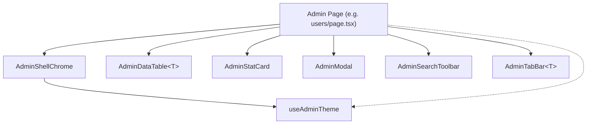

# Data Model: Admin Shared Components Library

**Feature**: `010-admin-shared-components`
**Date**: 2026-03-26

> This feature has no database entities. This document defines the **component interface contracts** (TypeScript types) that serve as the shared API surface.

---

## Entity 1: AdminShellChrome (Enhanced)

The top-level layout wrapper for all admin pages.

| Prop | Type | Required | Description |
|------|------|----------|-------------|
| activePath | `AdminShellRoute` | ✅ | Current route for sidebar highlighting |
| sectionLabel | `string` | ✅ | Breadcrumb section name |
| pageTitle | `string` | ✅ | Page `<h1>` text |
| subtitle | `string` | ❌ | Description text below title |
| action | `ReactNode` | ❌ | Primary action button in header |
| headerAccessory | `ReactNode` | ❌ | Accessory element next to title (e.g., user badge) |
| subNav | `ReactNode` | ❌ | Tab bar or sub-navigation below header |
| children | `ReactNode` | ✅ | Page content |
| floatingAction | `ReactNode` | ❌ | Fixed FAB button |

**Supported routes**: `/admin`, `/admin/users`, `/admin/content`, `/admin/codes`, `/admin/questions`, `/admin/overrides`

---

## Entity 2: AdminDataTable\<T\>

A generic, typed data table with built-in pagination.

| Prop | Type | Required | Description |
|------|------|----------|-------------|
| columns | `AdminColumn<T>[]` | ✅ | Column definitions |
| data | `T[]` | ✅ | Full dataset (paginated client-side) |
| loading | `boolean` | ❌ | Show skeleton rows |
| pageSize | `number` | ❌ | Rows per page (default: 8) |
| emptyMessage | `string` | ❌ | Text for empty state (default: "لا توجد نتائج.") |
| rowKey | `(row: T) => string` | ✅ | Unique key extractor |

**AdminColumn\<T\> type**:

| Field | Type | Required | Description |
|-------|------|----------|-------------|
| key | `string` | ✅ | Unique column identifier |
| label | `string` | ✅ | Column header text |
| render | `(row: T) => ReactNode` | ✅ | Cell renderer |
| align | `'right' \| 'left' \| 'center'` | ❌ | Text alignment (default: `'right'`) |

**Internal state**: `page: number` (managed internally, reset on data change)

---

## Entity 3: AdminStatCard

A metric display card with three visual variants.

| Prop | Type | Required | Description |
|------|------|----------|-------------|
| icon | `LucideIcon` | ✅ | Lucide icon component |
| label | `string` | ✅ | Small uppercase label |
| value | `string \| number` | ✅ | Large display value (auto-formatted if number) |
| variant | `'light' \| 'accent' \| 'muted'` | ✅ | Visual style variant |
| subtitle | `string` | ❌ | Small text below the value |
| children | `ReactNode` | ❌ | Extra content below value (e.g., avatar stack) |

---

## Entity 4: AdminModal

An animated overlay dialog.

| Prop | Type | Required | Description |
|------|------|----------|-------------|
| open | `boolean` | ✅ | Whether the modal is visible |
| onClose | `() => void` | ✅ | Close callback |
| title | `string` | ❌ | Modal heading |
| subtitle | `string` | ❌ | Small label above heading |
| maxWidth | `string` | ❌ | Max width class (default: `'max-w-xl'`) |
| children | `ReactNode` | ✅ | Modal body content |

---

## Entity 5: AdminSearchToolbar

A search + filter action bar.

| Prop | Type | Required | Description |
|------|------|----------|-------------|
| value | `string` | ✅ | Current search term |
| onChange | `(value: string) => void` | ✅ | Search input change handler |
| placeholder | `string` | ❌ | Input placeholder text |
| actions | `ReactNode` | ❌ | Slot for filter/export buttons |

---

## Entity 6: AdminTabBar\<T extends string\>

A sub-navigation pill button bar.

| Prop | Type | Required | Description |
|------|------|----------|-------------|
| tabs | `AdminTab<T>[]` | ✅ | Tab definitions |
| activeTab | `T` | ✅ | Currently active tab key |
| onSelect | `(tab: T) => void` | ✅ | Tab selection callback |

**AdminTab\<T\> type**:

| Field | Type | Required | Description |
|-------|------|----------|-------------|
| key | `T` | ✅ | Unique tab identifier |
| label | `string` | ✅ | Display text |
| icon | `LucideIcon` | ❌ | Optional icon |

---

## Entity Relationship Diagram

Each admin page composes these components. Only `AdminShellChrome` directly consumes `useAdminTheme`. Other components receive theme styling via CSS custom properties set on the shell's root `
`.
