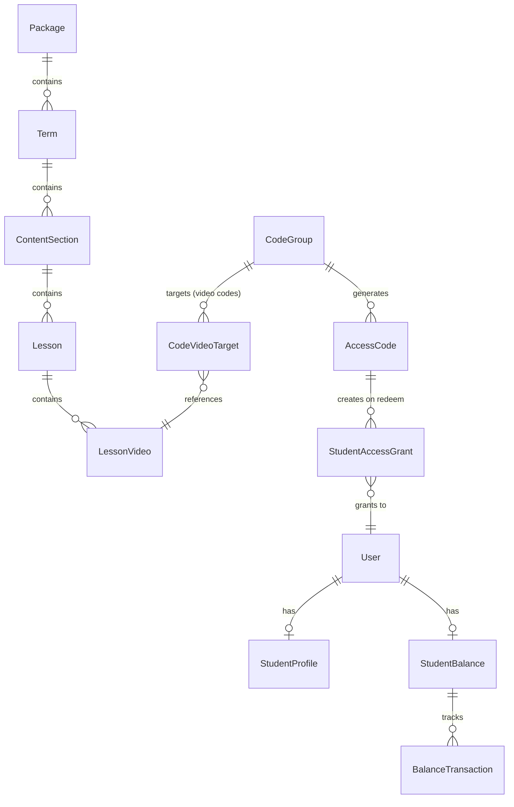

# Data Model: Registration, Code System & Content Hierarchy Overhaul

**Branch**: `014-registration-codes-hierarchy`
**Date**: 2026-03-27

## New Enums

### EducationStage
```
Secondary = 0
Baccalaureate = 1
```

### GradeLevel
```
FirstSecondary = 0
SecondSecondary = 1
FirstBaccalaureate = 2
SecondBaccalaureate = 3
```

### StudyTrack
```
// Secondary tracks
Arts = 0          // أدبي (Second Secondary only)
Science = 1       // علمي (Second Secondary only)

// Baccalaureate tracks (Second Baccalaureate only)
MedicineAndLifeSciences = 2      // الطب وعلوم الحياة
EngineeringAndComputerScience = 3 // الهندسة وعلوم الحاسب
Business = 4                      // قطاع الأعمال
ArtsAndHumanities = 5            // الآداب والفنون
```

### Gender
```
Male = 0
Female = 1
```

### CodeType
```
Package = 0      // Full package/year access
Term = 1         // Specific term access
Month = 2        // Specific content section/month access
Lesson = 3       // Specific lesson access
Video = 4        // Specific video(s) access
Exam = 5         // Specific exam access
Balance = 6      // Credit added to student balance
```

## Modified Entities

### StudentProfile (MODIFY)

Current fields retained. New fields added:

| Field | Type | Nullable | Notes |
|-------|------|----------|-------|
| StudentCode | string | No | Dostab student code |
| DateOfBirth | DateTime | No | |
| Gender | Gender (enum) | No | |
| Address | string | No | |
| EducationStage | EducationStage (enum) | No | |
| GradeLevel | GradeLevel (enum) | No | |
| StudyTrack | StudyTrack? (enum) | Yes | Only for SecondSecondary and SecondBaccalaureate |
| IsFatherAlive | bool | No | Default: true |
| IsMotherAlive | bool | No | Default: true |

Fields to **REMOVE**:
- `City` → replaced by `Address`
- `School` → removed (not in new requirements)
- `Grade` (string) → replaced by `GradeLevel` (enum)
- `Track` (string) → replaced by `StudyTrack` (enum)

**Validation rules**:
- If EducationStage = Secondary → GradeLevel must be FirstSecondary or SecondSecondary
- If EducationStage = Baccalaureate → GradeLevel must be FirstBaccalaureate or SecondBaccalaureate
- StudyTrack required only when GradeLevel is SecondSecondary or SecondBaccalaureate
- StudyTrack must be null when GradeLevel is FirstSecondary or FirstBaccalaureate
- Secondary tracks (Arts, Science) only valid for SecondSecondary
- Baccalaureate tracks (Medicine, Engineering, Business, ArtsAndHumanities) only valid for SecondBaccalaureate

### CodeGroup (MODIFY)

New fields:

| Field | Type | Nullable | Notes |
|-------|------|----------|-------|
| CodeType | CodeType (enum) | No | Default: Package |
| TermId | Guid? | Yes | For Term codes |
| ContentSectionId | Guid? | Yes | For Month codes |
| ExamId | Guid? | Yes | For Exam codes |
| DiscountPercentage | decimal? | Yes | 0-100 |
| BalanceAmount | decimal? | Yes | For Balance codes only |
| ExpiresAt | DateTime? | Yes | Code group expiration |
| QrDataGenerated | bool | No | Default: false |

New navigation:

| Field | Type | Notes |
|-------|------|-------|
| Term | Term? | Navigation |
| ContentSection | ContentSection? | Navigation |
| Exam | Exam? | Navigation |
| CodeVideoTargets | ICollection\<CodeVideoTarget\> | For Video codes |

### AccessCode (MODIFY)

New fields:

| Field | Type | Nullable | Notes |
|-------|------|----------|-------|
| QrCodeUrl | string? | Yes | Generated QR image URL/path |
| ExpiresAt | DateTime? | Yes | Individual code expiration |

### StudentAccessGrant (MODIFY)

New fields:

| Field | Type | Nullable | Notes |
|-------|------|----------|-------|
| TermId | Guid? | Yes | For term-level access |
| ContentSectionId | Guid? | Yes | For month-level access |
| LessonVideoId | Guid? | Yes | For video-level access |
| ExamId | Guid? | Yes | For exam-level access |
| GrantType | CodeType (enum) | No | What level of access was granted |

### Package (MODIFY — now represents Year)

New fields:

| Field | Type | Nullable | Notes |
|-------|------|----------|-------|
| Terms | ICollection\<Term\> | No | Navigation to child terms |

### ContentSection (MODIFY)

Change parent FK:

| Field | Change | Notes |
|-------|--------|-------|
| PackageId | REMOVE | No longer direct child of Package |
| TermId | ADD (Guid, required) | Now child of Term |
| Term | ADD (Term, navigation) | Navigation property |

### LessonVideo (MODIFY)

New field:

| Field | Type | Nullable | Notes |
|-------|------|----------|-------|
| VideoTag | string? | Yes | Admin-assigned type/tag |

## New Entities

### Term (NEW)

| Field | Type | Nullable | Notes |
|-------|------|----------|-------|
| Id | Guid | No | PK (from BaseEntity) |
| Title | string | No | e.g., "Term 1", "الترم الأول" |
| Order | int | No | Display order within package |
| PackageId | Guid | No | FK to Package |
| Package | Package | No | Navigation |
| Sections | ICollection\<ContentSection\> | No | Navigation |
| CreatedAt | DateTime | No | From BaseEntity |

### StudentBalance (NEW)

| Field | Type | Nullable | Notes |
|-------|------|----------|-------|
| Id | Guid | No | PK (from BaseEntity) |
| UserId | Guid | No | FK to User (unique) |
| User | User | No | Navigation |
| CurrentBalance | decimal | No | Default: 0. Must be >= 0 |
| CreatedAt | DateTime | No | From BaseEntity |
| UpdatedAt | DateTime | No | |

### BalanceTransaction (NEW)

| Field | Type | Nullable | Notes |
|-------|------|----------|-------|
| Id | Guid | No | PK (from BaseEntity) |
| StudentBalanceId | Guid | No | FK to StudentBalance |
| StudentBalance | StudentBalance | No | Navigation |
| Amount | decimal | No | Positive = credit, Negative = debit |
| BalanceAfter | decimal | No | Balance snapshot after transaction |
| TransactionType | string | No | "CodeRedemption", "ContentPurchase", "AdminAdjustment" |
| ReferenceId | Guid? | Yes | FK to AccessCode or AccessGrant |
| Description | string | No | Human-readable description |
| CreatedAt | DateTime | No | From BaseEntity |

### CodeVideoTarget (NEW — join table for Video codes)

| Field | Type | Nullable | Notes |
|-------|------|----------|-------|
| Id | Guid | No | PK |
| CodeGroupId | Guid | No | FK to CodeGroup |
| CodeGroup | CodeGroup | No | Navigation |
| LessonVideoId | Guid | No | FK to LessonVideo |
| LessonVideo | LessonVideo | No | Navigation |

## Entity Relationship Diagram



## Migration Strategy

1. **Create new enums**: EducationStage, GradeLevel, StudyTrack, Gender, CodeType
2. **Create Term table**: With FK to Package
3. **Data migration**: For each existing Package, create a default "Term 1" record
4. **Modify ContentSection**: Add TermId FK, populate from default Term, then drop PackageId FK
5. **Extend StudentProfile**: Add new fields (nullable initially for existing records)
6. **Extend CodeGroup**: Add CodeType, new FKs, discount, expiration
7. **Extend AccessCode**: Add QrCodeUrl, ExpiresAt
8. **Extend StudentAccessGrant**: Add TermId, ContentSectionId, LessonVideoId, ExamId, GrantType
9. **Create StudentBalance**: New table
10. **Create BalanceTransaction**: New table
11. **Create CodeVideoTarget**: New join table
12. **Backfill existing data**: Set CodeType=Package for existing CodeGroups, set GrantType=Package for existing grants
