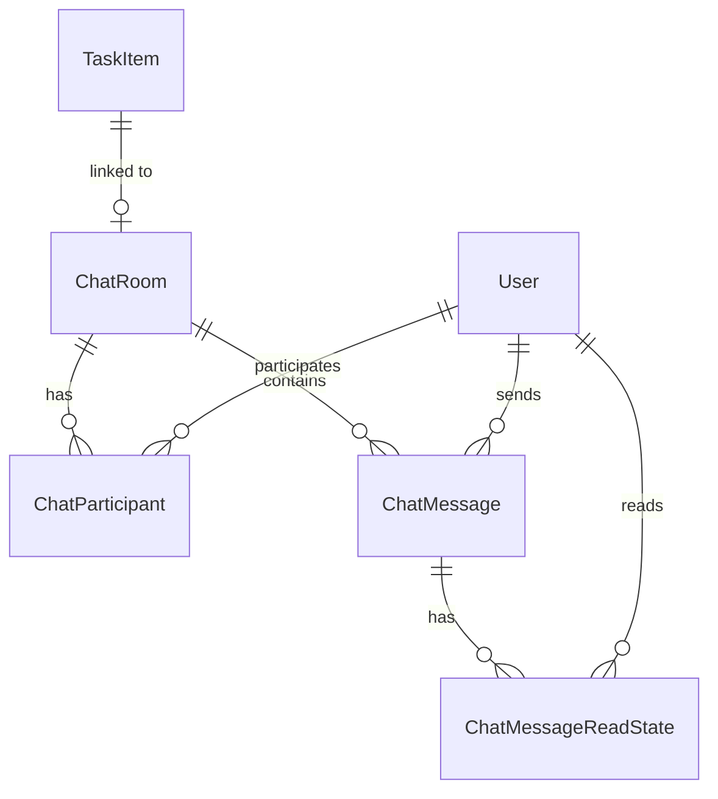

# Data Model: Internal Chat, Workrooms, and Real-Time Notifications

## Database Tables

### 1. ChatRoom
Represents a communication channel.
- `Id` (`uuid`, Primary Key)
- `Name` (`varchar(100)`, Nullable) - Used for group chats. Nullable for 1-to-1 direct chats.
- `Type` (`integer`, Required) - Enum:
  - `0`: `Individual` (1-to-1)
  - `1`: `Group`
  - `2`: `Workroom` (tied to an operations task)
- `TaskItemId` (`uuid`, Nullable, Foreign Key referencing `TaskItems.Id`, Cascade delete)
- `IsArchived` (`boolean`, Required, Default: `false`)
- `CreatedAt` (`timestamp`, Required)
- `CreatedByUserId` (`uuid`, Required, Foreign Key referencing `Users.Id`)

### 2. ChatParticipant
Tracks members of a chat room. Composite Primary Key: `(ChatRoomId, UserId)`.
- `ChatRoomId` (`uuid`, Primary Key, Foreign Key referencing `ChatRooms.Id`, Cascade delete)
- `UserId` (`uuid`, Primary Key, Foreign Key referencing `Users.Id`, Cascade delete)
- `JoinedAt` (`timestamp`, Required)
- `LastReadMessageId` (`uuid`, Nullable, Foreign Key referencing `ChatMessages.Id`)

### 3. ChatMessage
Stores messages sent within a room.
- `Id` (`uuid`, Primary Key)
- `ChatRoomId` (`uuid`, Required, Index, Foreign Key referencing `ChatRooms.Id`, Cascade delete)
- `SenderUserId` (`uuid`, Required, Index, Foreign Key referencing `Users.Id`)
- `Content` (`text`, Required)
- `Type` (`integer`, Required) - Enum:
  - `0`: `Text`
  - `1`: `Attachment` (Image/File/Audio)
  - `2`: `System` (e.g. "User X joined", "Room was archived")
- `MediaUrl` (`varchar(500)`, Nullable)
- `MediaMetadata` (`text` / JSONB, Nullable) - Stores height, width, file name, size, duration, etc.
- `IsPinned` (`boolean`, Required, Default: `false`)
- `CreatedAt` (`timestamp`, Required, Index)

### 4. ChatMessageReadState
Tracks read receipts per user per message. Composite Primary Key: `(MessageId, UserId)`.
- `MessageId` (`uuid`, Primary Key, Foreign Key referencing `ChatMessages.Id`, Cascade delete)
- `UserId` (`uuid`, Primary Key, Foreign Key referencing `Users.Id`, Cascade delete)
- `ReadAt` (`timestamp`, Required)

---

## Entity Relationships

## Validation Rules & State Transitions

- **Direct Chat Uniqueness**: Only one active (non-archived) `Individual` chat room can exist between any two specific users. Prior to creating a direct room, the backend MUST verify if a room already exists for this pair.
- **Message Permissions**:
  - A user can only post messages to a room if they are active `ChatParticipants` in that room.
  - If a room's `IsArchived` flag is `true`, only users with `Admin` or `Supervisor` roles can post messages. Other users' requests MUST fail with `400 Bad Request` containing "Room is archived".
- **Message Pinning**:
  - Any participant can pin or unpin messages unless the room is archived, in which case only Admins/Supervisors can modify pins.
