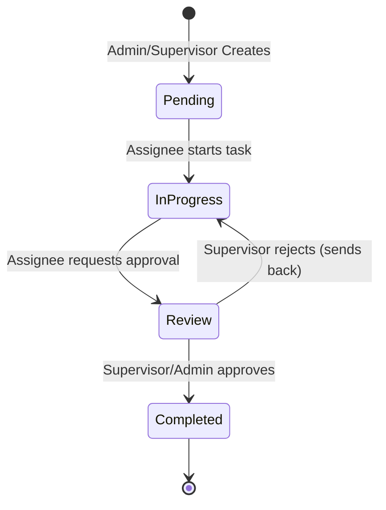

# Data Model and State Transitions: Assistant and Task Workflow

## Entities

### 1. TaskItem (AdminTask)
Represents a task tracked in Nader Gorge platform.

| Property | Type | Nullable | Description |
|---|---|---|---|
| `Id` | Guid | No | Primary key |
| `Title` | string | No | Title of the task |
| `Description` | string | No | Detailed description |
| `Status` | TaskStatus (Enum) | No | Pending=0, InProgress=1, Review=2, Completed=3 |
| `Priority` | TaskPriority (Enum) | No | Low=0, Medium=1, High=2 |
| `AssigneeId` | Guid | No | Foreign Key to User (the assistant) |
| `CreatedById` | Guid | No | Foreign Key to User (creator, usually admin) |
| `ApprovedById` | Guid | Yes | Foreign Key to User (the supervisor/admin who approved completion) |
| `DueDate` | DateTime | Yes | Expected deadline |
| `CompletedAt` | DateTime | Yes | Time when the task was marked completed |
| `CreatedAt` | DateTime | No | Creation timestamp |
| `UpdatedAt` | DateTime | No | Last update timestamp |

### 2. TaskComment (AdminTaskComment)
Represents a comment posted on a task.

| Property | Type | Nullable | Description |
|---|---|---|---|
| `Id` | Guid | No | Primary key |
| `TaskId` | Guid | No | Foreign Key to TaskItem |
| `UserId` | Guid | No | Foreign Key to User (author) |
| `Content` | string | No | Comment text content |
| `AttachmentUrl` | string | Yes | Optional link to an uploaded file/image |
| `CreatedAt` | DateTime | No | Creation timestamp |

---

## State Transition Rules

The status of a task can transition as follows:

### Transition Authorization Matrix

| Initial State | Target State | Allowed Roles | Enforced Logic |
|---|---|---|---|
| `Pending` | `InProgress` | Assignee, Admin, Supervisor | Normal start of work |
| `InProgress` | `Review` | Assignee, Admin, Supervisor | Work submitted for approval |
| `InProgress` | `Completed` | Admin, Supervisor | Regular assistants cannot bypass Review |
| `Review` | `Completed` | Admin, Supervisor | Requires approval (Supervisor/Admin) |
| `Review` | `InProgress` | Admin, Supervisor | Rejection/re-assignment of work |
| `Completed` | Any State | Admin, Supervisor | Locked for regular assistants |
