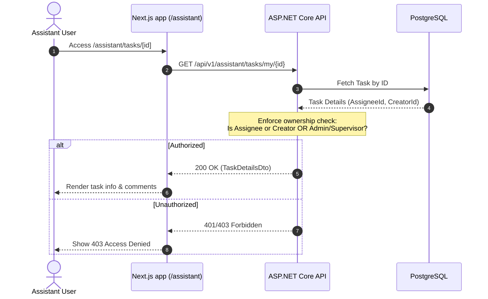

# Research Notes: Assistant Surface and Task Workflow Security

## Decisions

### 1. Backend Task Ownership Enforcement

- **Decision**: Update MediatR handlers (`GetTaskDetailsQueryHandler`, `AddTaskCommentCommandHandler`, `UpdateTaskStatusCommandHandler`) to check task ownership.
- **Rationale**: Currently, the assistant endpoints allow any user to read/comment on any task as long as they hit the endpoint with a Task ID. Enforcing ownership checks ensures:
  - A user can only access a task if they are the Assignee, Creator, Admin, or have the supervisor permission (`hr.manage` / role Admin/Supervisor).
  - If a user is not authorized, throw `UnauthorizedAccessException`, which the exception handler middleware maps to 401/403.
- **Alternatives Considered**: Checking roles inside the controller. Rejected because it violates our Clean Architecture guidelines where domain/application level validation and authorization belong in the Application layer (MediatR handlers).

### 2. Task Completion Transition Safeguard

- **Decision**: Restrict direct transition of task status to `Completed` by non-managers (regular assistants).
- **Rationale**: When a regular assistant marks a task as done, it must go into `Review` status. Only an Admin or Supervisor (manager) can change status from `Review` to `Completed` (or transition out of `Completed`/`Review` once locked).
- **Alternatives Considered**: Allow assistants to complete tasks directly. Rejected because business requirements demand manager verification for operational tasks.

### 3. Assistant Portal Navigation Isolation

- **Decision**: Define the Assistant Navbar using a dynamic layout. Filter navigation items based on the user's explicit roles/permissions.
- **Rationale**: A regular assistant should not see or be able to click tabs like CRM or Financials unless they have the corresponding permissions. Hiding these tabs prevents visual clutter and UX confusion.
- **Alternatives Considered**: Render all tabs but show 403 pages when clicked. Rejected because it provides a poor user experience.

---

## Technical Flow Diagram (Mermaid)

