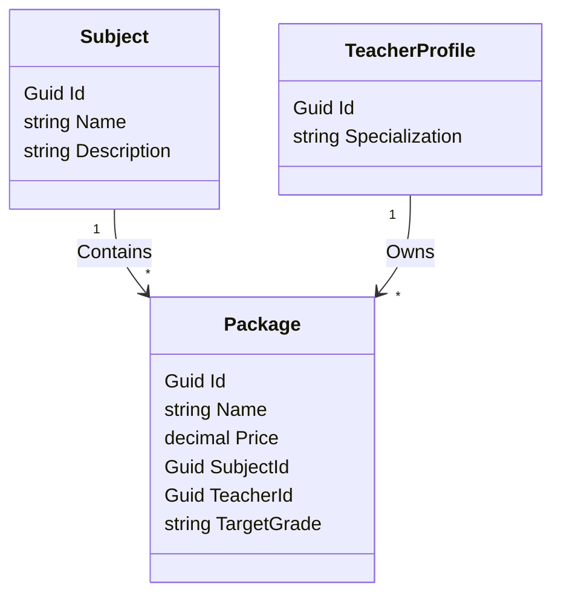

# Data Model: Remove Programs and Link Packages Directly to Subjects

## Database Changes

### Deleted Table: `programs`
- This table and entity are dropped entirely.

### Modified Table: `packages`
- **Columns Removed**:
  - `ProgramId` (UUID)
- **Columns Added**:
  - `SubjectId` (UUID, Foreign Key referencing `subjects.Id`)
  - `TargetGrade` (VARCHAR(100), not null, default `""` / `"All"`)

### Relationships
- **Subject** has a one-to-many relationship with **Package**:
  - A Subject can contain multiple Packages.
  - A Package belongs to exactly one Subject.
- **TeacherProfile** has a one-to-many relationship with **Package**:
  - A Teacher can own multiple Packages.
  - A Package belongs to exactly one Teacher.

