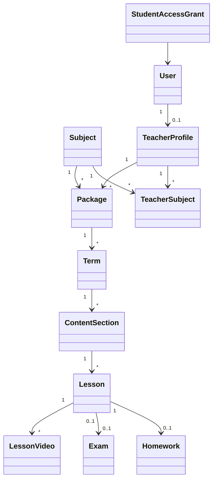

# Data Model: E2E Test Flow for Course Content Creation and Access

The integration test flow uses the following existing domain entities and relationships:

## Entity Details

- **Subject**:
  - `Id` (Guid)
  - `Name` (string)
  - `Description` (string)
- **User / TeacherProfile / TeacherSubject**:
  - `User`: Handles teacher authentication (phoneNumber, password).
  - `TeacherProfile`: Bio, Specialization (comma-separated grades), CommissionRate.
  - `TeacherSubject`: Maps teacher profiles to subjects.
- **Package**:
  - `Name` (string)
  - `Description` (string)
  - `Price` (decimal)
  - `SubjectId` (Guid)
  - `TargetGrade` (string, e.g., "1st Secondary")
  - `TeacherId` (Guid)
- **Term (Month)**:
  - `Title` (string, e.g., "Month 1")
  - `Order` (int)
  - `PackageId` (Guid)
  - `Price` (decimal)
- **ContentSection**:
  - `Title` (string)
  - `Order` (int)
  - `TermId` (Guid)
  - `Price` (decimal)
- **Lesson**:
  - `Title` (string)
  - `Summary` (string)
  - `Order` (int)
  - `ContentSectionId` (Guid)
  - `Price` (decimal)
  - `ExamId` (Guid, optional)
- **LessonVideo**:
  - `Title` (string)
  - `Provider` (string, e.g., "youtube")
  - `ProviderVideoId` (string)
  - `LessonId` (Guid)
- **Exam / ExamQuestion / Homework**:
  - `Exam`: TotalScore, PassingScore, isMandatory.
  - `ExamQuestion`: Inline questions.
  - `Homework`: Title, LessonId, totalScore, isMandatory.
- **StudentAccessGrant**:
  - Tracks user content ownership (GrantType: Lesson/Month/Term/Package).
