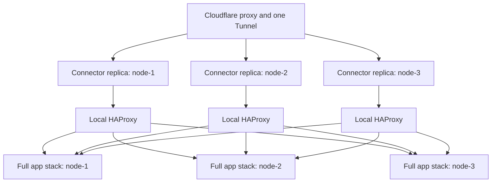
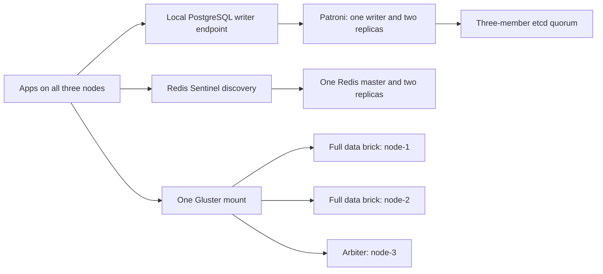

# Production Cluster Architecture

## Traffic and application topology

Each node runs the backend, worker, landing, student, Admin, teacher, staff and
gateway services. A connector always enters through its node-local HAProxy, and
that HAProxy distributes ready requests across all three gateways. The approved
hosts are:

| Host | Surface |
|---|---|
| `massar-academy.net` | Public landing |
| `app.massar-academy.net` | Student application |
| `admin.massar-academy.net` | Admin application |
| `teacher.massar-academy.net` | Teacher application |
| `staff.massar-academy.net` | Staff application |
| `api.massar-academy.net` | HTTP API |
| `ws.massar-academy.net` | WebSocket/SignalR |
| `assets.massar-academy.net` | Public and authorized assets |

Unknown hosts are rejected. Database, Redis, etcd, Patroni, Gluster and local
HAProxy ports are not public.

## Stateful topology

PostgreSQL is the only authoritative relational store. Patroni may move the
writer role, but applications keep using the stable local writer endpoint.
Redis coordinates cache, SignalR and BullMQ; it is not the source of truth.
Gluster exposes one logical filesystem with two full byte copies and a third
arbiter vote.

## Role and failure matrix

| Failure | Expected behavior | Safety boundary |
|---|---|---|
| One app/gateway | Removed from readiness pool; two nodes continue | No session state may live only in a process |
| One tunnel connector | Cloudflare uses the other connectors | All replicas use the same tunnel |
| PostgreSQL writer | Patroni elects one safe replacement | Quorum loss refuses unsafe writes |
| One PostgreSQL replica | Writer plus one replica continue | Repair before another maintenance event |
| Redis master | Sentinel promotes one replica | Durable truth remains in PostgreSQL |
| One Gluster data brick | Other full copy serves acknowledged files | No-quorum writes must fail |
| One whole server | Remaining two keep quorum and service | Never take a second member down |
| Two servers | Availability is not promised | Prefer explicit refusal over split brain |
| Internal three-node backup repository | New backups fail and alert | Production cutover remains blocked if stale or fewer than three Garage members are healthy |

## Release invariant

All nodes must run the same immutable image digests. Schema migration runs once
under an advisory lock before the rolling application update. One node is
drained at a time, and a failed readiness gate stops the rollout.
